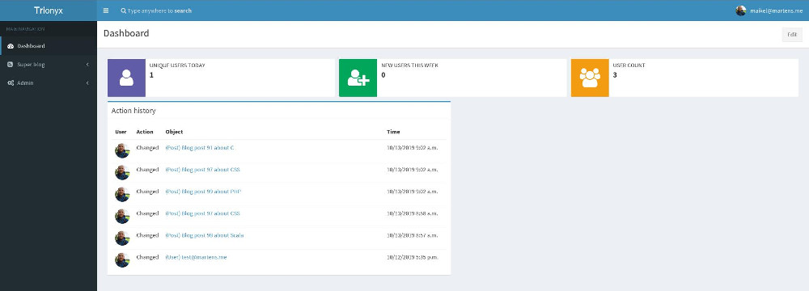

.. image:: https://circleci.com/gh/krukas/Trionyx/tree/master.svg?style=svg
    :target: https://circleci.com/gh/krukas/Trionyx/tree/master
    
.. image:: https://readthedocs.org/projects/trionyx/badge/?version=latest
    :target: http://trionyx.readthedocs.io/en/latest

.. image:: https://codecov.io/gh/krukas/Trionyx/branch/master/graph/badge.svg
  :target: https://codecov.io/gh/krukas/Trionyx

.. image:: https://badge.fury.io/py/Trionyx.svg
    :target: https://badge.fury.io/py/Trionyx
    

Trionyx
=======

Trionyx is a Django web stack/framework for creating business applications.
It's focus is for small company's that want to use business application instead of Excel and Google doc sheets.

With Trionyx the developer/business can focus on there domain models,
business rules and processes and Trionyx will take care of the interface.

Built With
~~~~~~~~~~
- Django_
- Celery_
- AdminLTE_

Features
========

Here are some of the features that comes with Trionyx:

- Auto CRUD interface for your models, based on your permissions.
- Customizable dashboard with default configurable widgets and easily create your own widgets.
- Advanced list view, with featured like
    * Customizable columns and columns layout
    * Search and Filters for all your fields
    * Export to CSV
    * Mass update and delete
- Build layout and forms without HTML.
- Improved search and global search.
- Support for background and tracked background tasks.
- History log of all model changes by user or system.
- Easy Permission management with tree permission selector
- Build in admin logs interface. That shows you how many time a log occurs,
  last time, location, traceback and user with the user agent and path.

Documentation
=============

You can find the documentation here_, a good place to start is the `getting started guide`_

Installation
============
To install Trionyx, run:

    pip install Trionyx

Create new project
==================
For creating a new project, run:

    trionyx create_project new_project

Follow the steps, and by the end you have a running base project ready to extend.

Contributing
============
Bug reports, bug fixes, and new features are always welcome.
Please raise issues on the `Trionyx github repository`_, and submit pull requests for any new code.

You can run the test suite yourself with the following command:

    make test

Authors
=======

- **Maikel Martens** - *creator* - Krukas_

License
=======
This project is licensed under the GPLv3 License - see the LICENSE.txt file for details

Change log
==========
You can find the changelog in the `docs`_

.. _Django: https://www.djangoproject.com/
.. _Celery: http://www.celeryproject.org/
.. _AdminLTE: https://adminlte.io/

.. _docs: https://trionyx.readthedocs.io/en/latest/trionyx/changelog.html
.. _Trionyx github repository: https://github.com/krukas/Trionyx/issues
.. _Krukas: https://github.com/krukas
.. _here: https://trionyx.readthedocs.io/en/latest/
.. _getting started guide: https://trionyx.readthedocs.io/en/latest/trionyx/getting-started.html